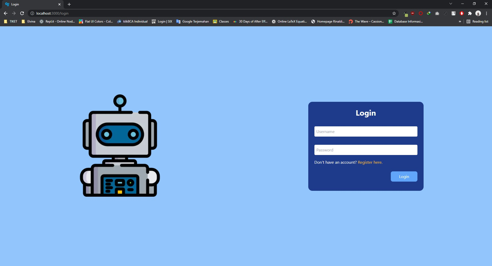
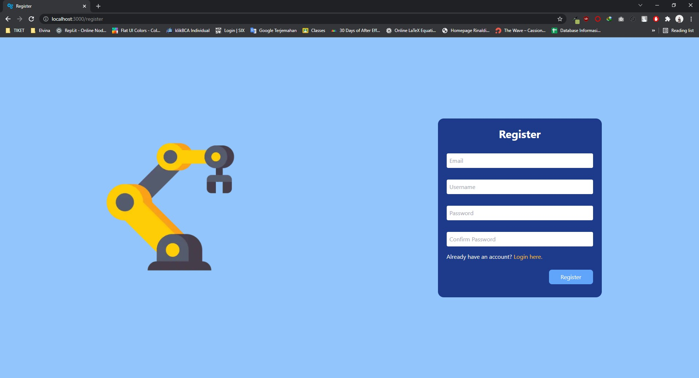
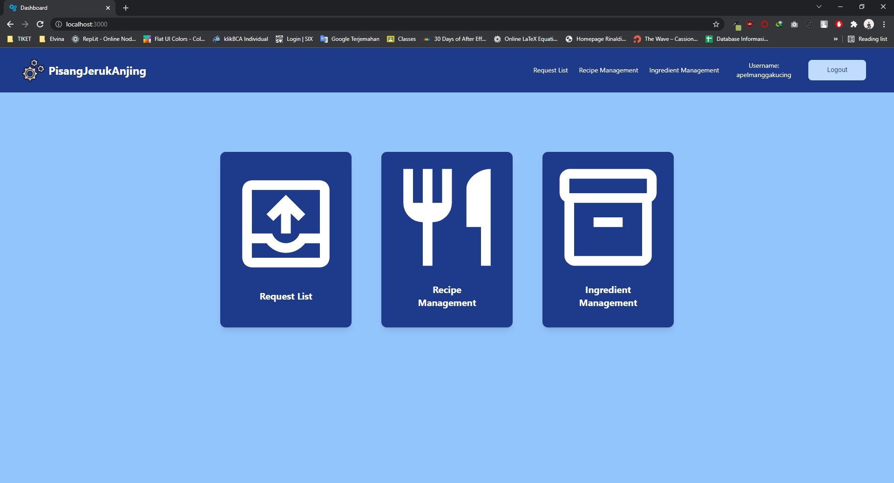
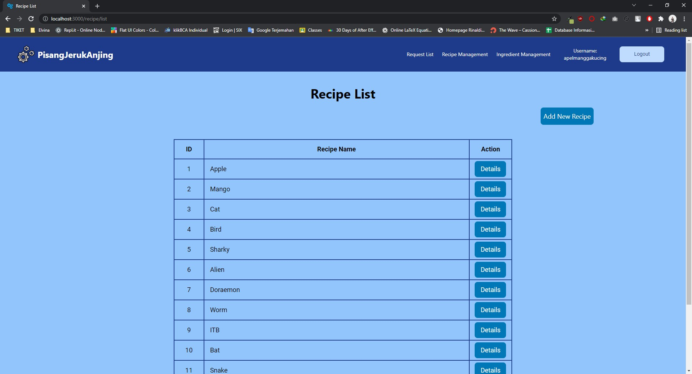
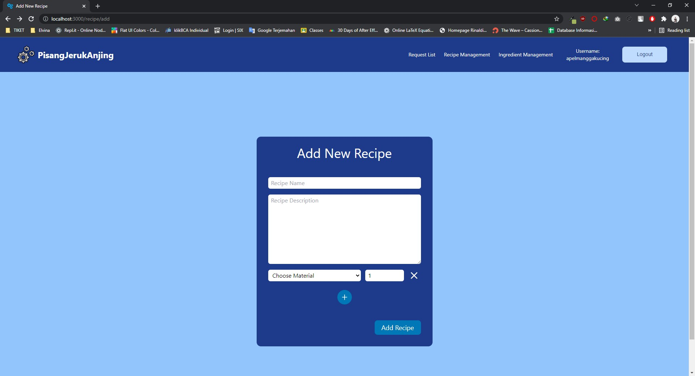
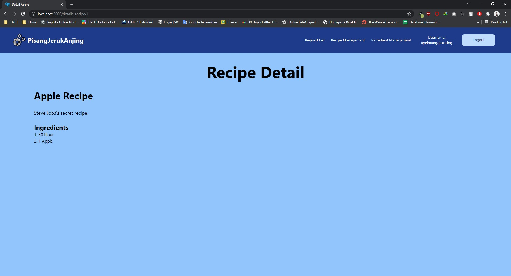
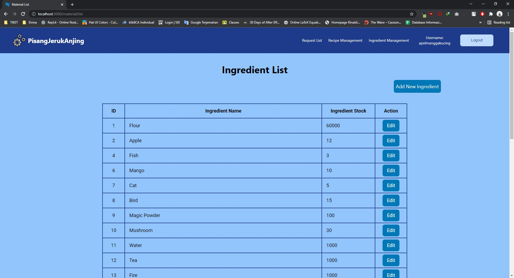
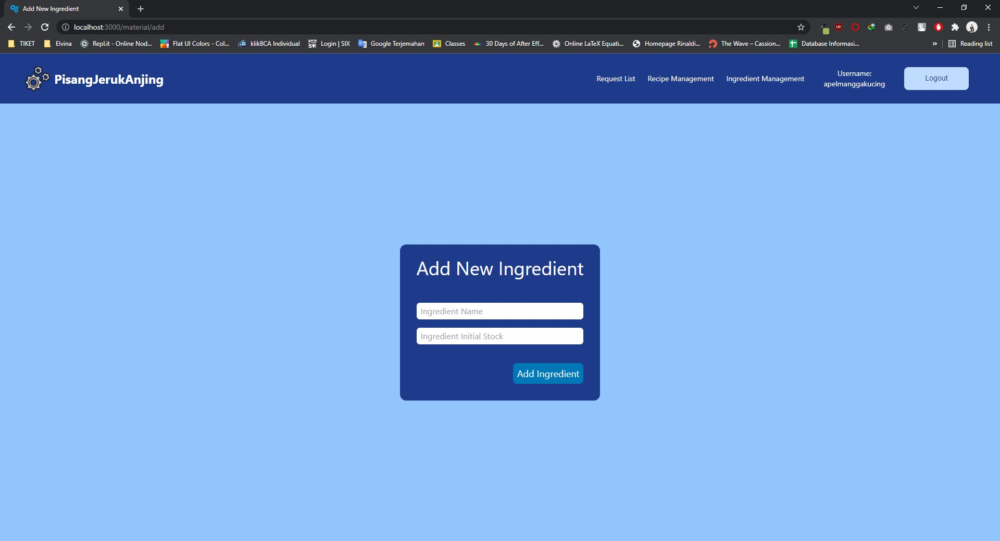
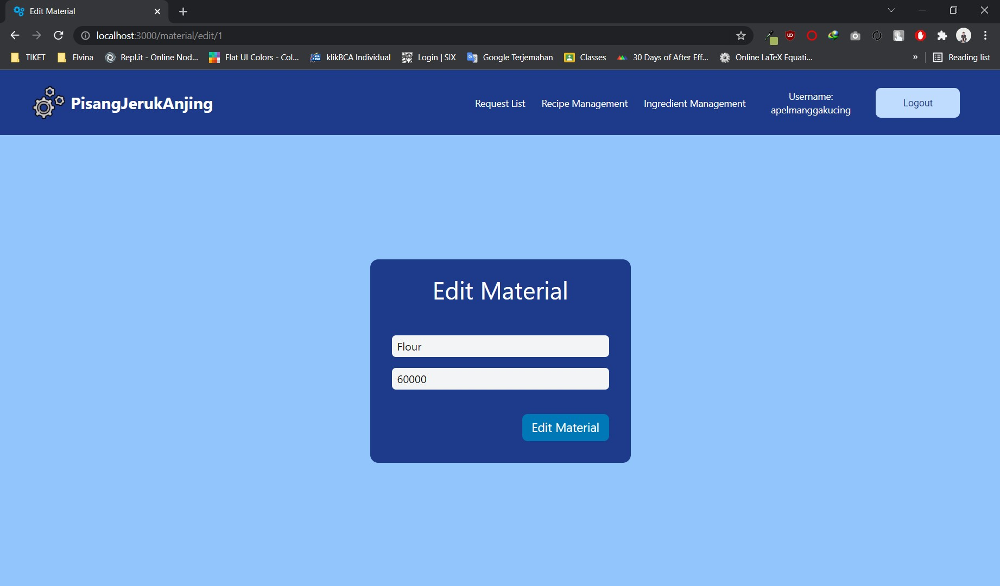
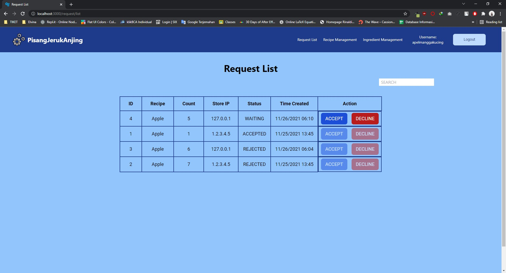

# Cara Menjalankan

## Melalui Lokal
1. Pastikan sudah install Node.js dan npm
2. Jalankan `npm install`
3. Untuk menjalankan aplikasi di production mode, jalankan `npm run build` dan `npm run start`
4. Aplikasi dapat diakses di localhost port 3000 melalui web browser

## Melalui Docker
1. Pastikan sudah install Docker dan Docker Compose
2. Jalankan `docker-compose up`
3. Aplikasi dapat diakses di localhost port 3000 melalui web browser

# Deskripsi
Aplikasi untuk client dorayaki factory ini dibuat dengan menggunakan Next.js sebagai framework React. Digunakan juga framework CSS yaitu Tailwind CSS untuk styling. Pengembangan aplikasi dilakukan menggunakan TypeScript. Aplikasi ini berupa antarmuka di web untuk pabrik dorayaki, di mana admin dapat melihat daftar dan detail resep, menambah resep, melihat daftar bahan baku resep, dan mengatur stok bahan baku. Selain itu, pada situs web juga terdapat daftar request di mana admin dapat melihat request dari toko untuk dorayaki berdasarkan resep dan tombol untuk menerima atau menolak request tersebut. Untuk autentikasi pengguna, terdapat fitur login dan register beserta autentikasi melalui JWT token. Token JWT pengguna disimpan di HTTP only cookie yang akan digunakan untuk verifikasi pengguna melalui komunikasi dengan server di backend.

# Screenshot Tampilan Aplikasi
1. Halaman Login

2. Halaman Register

3. Halaman Dashboard

4. Halaman List Recipe

5. Halaman Add Recipe

6. Halaman Detail Recipe

7. Halaman List Material

8. Halaman Add Material

9. Halaman Edit Material

10. Halaman List Request

# Pembagian Tugas
- Login + JWT Auth: 13519096
- Register: 13519096
- Detail resep: 13519096
- Daftar Resep: 13519090
- Tambah Resep: 13519090
- Daftar Bahan Baku: 13519090
- Tambah Bahan Baku: 13519090
- Edit bahan baku: 13519048
- Daftar Request: 13519048
- Docker: 13519096

